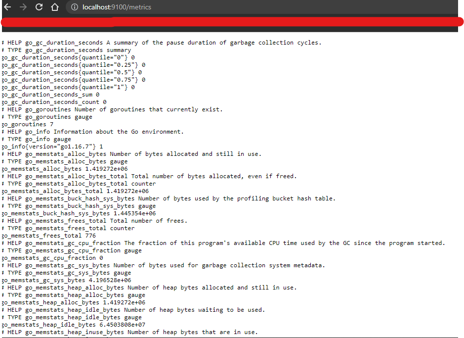
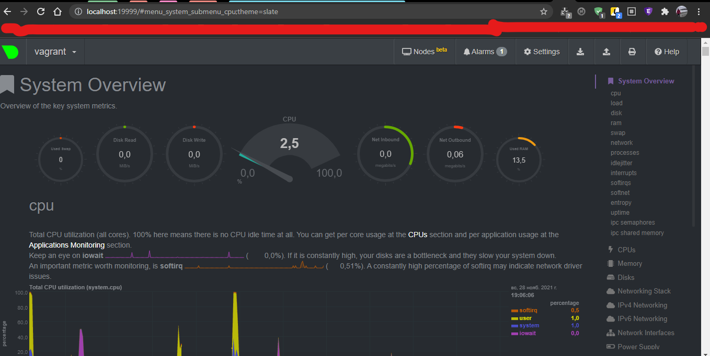

# ДЗ 3.4

## 1. Используя знания из лекции по systemd, создайте самостоятельно простой unit-файл для node_exporter:
- Добавлен в автозагрузку:
  ```
  sudo systemctl enable node_exporter.service
  ```
- Опции можно добавить через файл ```/opt/node_exporter-1.2.2.linux-amd64/node_exporter.env```, в переменной ```EXTRA_OPTS```
- Сервис стартует и перезапускается корректно:
  
  ```
    Nov 28 15:42:12 vagrant systemd[1]: Started "Netology - node_exporter".
    Nov 28 15:43:22 vagrant systemd[1]: Stopping "Netology - node_exporter"...
    Nov 28 15:43:22 vagrant systemd[1]: node_exporter.service: Succeeded.
    Nov 28 15:43:22 vagrant systemd[1]: Stopped "Netology - node_exporter".
    -- Reboot --
    Nov 28 15:43:41 vagrant systemd[1]: Started "Netology - node_exporter".
  ```
- Прописан конфигурационный файл:
    ```
    cat /usr/local/lib/systemd/system/node_exporter.service
        [Unit]
        Description="Netology - node_exporter"
        
        [Service]
        EnvironmentFile=/opt/node_exporter-1.2.2.linux-amd64/node_exporter.env
        ExecStart=/opt/node_exporter-1.2.2.linux-amd64/node_exporter $EXTRA_OPTS
        StandardOutput=file:/var/log/node_exporter.log
        StandardError=file:/var/log/node_exporter.log
        
        [Install]
        WantedBy=multi-user.target
    ```
## 2. Ознакомьтесь с опциями node_exporter и выводом /metrics по-умолчанию. Приведите несколько опций, которые вы бы выбрали для базового мониторинга хоста по CPU, памяти, диску и сети.
- CPU:
    ```
    node_cpu_seconds_total{cpu="0",mode="idle"} 2238.49
    node_cpu_seconds_total{cpu="0",mode="system"} 16.72
    node_cpu_seconds_total{cpu="0",mode="user"} 6.86
    process_cpu_seconds_total
    ```
    
- Memory:
    ```
    node_memory_MemAvailable_bytes 
    node_memory_MemFree_bytes
    ```
- Disk:
    ```
    node_disk_io_time_seconds_total{device="sda"} 
    node_disk_read_bytes_total{device="sda"} 
    node_disk_read_time_seconds_total{device="sda"} 
    node_disk_write_time_seconds_total{device="sda"}
    ```
- Network:
    ```
    node_network_receive_errs_total{device="eth0"} 
    node_network_receive_bytes_total{device="eth0"} 
    node_network_transmit_bytes_total{device="eth0"}
    node_network_transmit_errs_total{device="eth0"}
  ```
  
## 3. Установите в свою виртуальную машину Netdata. Воспользуйтесь готовыми пакетами для установки (sudo apt install -y netdata)...
- ```Netdata``` установлена
- порт ```19999``` проброшен 
- ```web-интерфейс``` работает:
    
## 4. Можно ли по выводу dmesg понять, осознает ли ОС, что загружена не на настоящем оборудовании, а на системе виртуализации?
    dmesg | grep -i 'Hypervisor'
    [    0.000000] Hypervisor detected: KVM
## 5. Как настроен sysctl fs.nr_open на системе по-умолчанию? Узнайте, что означает этот параметр. Какой другой существующий лимит не позволит достичь такого числа (ulimit --help)?
    /sbin/sysctl -n fs.nr_open 
    1048576
- ```1048576``` - Это максимальное число открытых дескрипторов для ядра (системы). Число задается кратное ```1024```. В данном случае = ```1024*1024```.
- Максимальный предел можно посмотреть командой:
  ```
    cat /proc/sys/fs/file-max
    9223372036854775807
  ```
- soft лимит на пользователя, но может быть увеличен процессов в процессе работы:
    ```
      ulimit -Sn
      1024
    ```
- hard лимит на пользователя, не может быть увеличен, может быть только уменьшен:
    ```
      ulimit -Hn
      1048576
    ```
## 6. Запустите любой долгоживущий процесс (не ls, который отработает мгновенно, а, например, sleep 1h) в отдельном неймспейсе процессов; покажите, что ваш процесс работает под PID 1 через nsenter. Для простоты работайте в данном задании под root (sudo -i). Под обычным пользователем требуются дополнительные опции (--map-root-user) и т.д.
```
    root@vagrant:~# ps -e |grep sleep
        1631 pts/0    00:00:00 sleep
    root@vagrant:~# nsenter --target 1631 --pid --mount
    root@vagrant:/# ps
        PID TTY          TIME CMD
          1 pts/0    00:00:00 sleep
          2 pts/0    00:00:00 bash
         11 pts/0    00:00:00 ps
```
## 7. Найдите информацию о том, что такое :(){ :|:& };:. Запустите эту команду в своей виртуальной машине Vagrant с Ubuntu 20.04 (это важно, поведение в других ОС не проверялось). Некоторое время все будет "плохо", после чего (минуты) – ОС должна стабилизироваться. Вызов dmesg расскажет, какой механизм помог автоматической стабилизации. Как настроен этот механизм по-умолчанию, и как изменить число процессов, которое можно создать в сессии?
- Shell бесконечно создаёт новые экземпляры себя.
- Стабилизация виртуалки произошло за счет - ```cgroup```:
    ```    
        [ 3697.657829] cgroup: fork rejected by pids controller in /user.slice/user-1000.slice/session-3.scope
    ```
- Чтобы изменить поведение, необходимо отредактировать файл:
  ```
  /usr/lib/systemd/system/user-.slice.d/10-defaults.conf
  ``` 
  параметр ```TasksMax``` - указывается конкретное число или infinity(чтобы убрать лимит совсем).