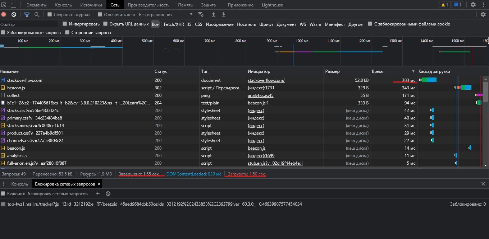

# ДЗ 3.6

## 1. Работа c HTTP через телнет.
- Команда:
```
telnet stackoverflow.com 80
[press enter]
GET /questions HTTP/1.0
HOST: stackoverflow.com
[press enter]
[press enter]
```
- Вывод:
```
Trying 151.101.129.69...
Connected to stackoverflow.com.
Escape character is '^]'.


GET /questions HTTP/1.0
HOST: stackoverflow.com

HTTP/1.1 301 Moved Permanently
cache-control: no-cache, no-store, must-revalidate
location: https://stackoverflow.com/questions
x-request-guid: 7d85e844-f720-42de-9109-46be89028938
feature-policy: microphone 'none'; speaker 'none'
content-security-policy: upgrade-insecure-requests; frame-ancestors 'self' https://stackexchange.com
Accept-Ranges: bytes
Date: Sun, 28 Nov 2021 12:48:34 GMT
Via: 1.1 varnish
Connection: close
X-Served-By: cache-bma1678-BMA
X-Cache: MISS
X-Cache-Hits: 0
X-Timer: S1638103714.964972,VS0,VE101
Vary: Fastly-SSL
X-DNS-Prefetch-Control: off
Set-Cookie: prov=08dab86e-028d-80a6-9318-160226296974; domain=.stackoverflow.com; expires=Fri, 01-Jan-2055 00:00:00 GMT; path=/; HttpOnly

Connection closed by foreign host.
```
- Коментарий: <br>
В данном случае произошло перенаправление, о чем свидетельствует код 301, куда - указано в поле ``` location ``` -> ``` location: https://stackoverflow.com/questions ```

## 2. Повторите задание 1 в браузере, используя консоль разработчика F12.
Полученный код ``` 307: Internal Redirect``` <br>
Самый долгий запрос = **383 мс**, общее время загрузки = **1.55 сек**



## 3. Какой IP адрес у вас в интернете?
- Команда:
```
wget -qO- eth0.me
```
- Вывод:
```
89.X.X.X
```
## 4. Какому провайдеру принадлежит ваш IP адрес? Какой автономной системе AS? Воспользуйтесь утилитой whois
- Команда:
```
whois 89.X.X.X | grep -E '(org-name:.*)|(origin:.*)'
```
- Вывод:
```
org-name:       PJSC "Vimpelcom"
origin:         AS3216
origin:         AS8402
```
## 5. Через какие сети проходит пакет, отправленный с вашего компьютера на адрес 8.8.8.8? Через какие AS? Воспользуйтесь утилитой traceroute
- Команда:
```
vagrant@vagrant:~$ traceroute -An 8.8.8.8
```
- Вывод:
```
traceroute to 8.8.8.8 (8.8.8.8), 30 hops max, 60 byte packets
 1  10.0.2.2 [*]  0.540 ms  15.308 ms  15.261 ms
 2  * * *
 3  * * *
 4  * * *
 5  * * *
 6  * * *
 7  * * *
 8  * * *
 9  * * *
10  * * *
11  * * *
12  * * *
13  * * *
14  * * *
15  * * *
16  * * *
17  * * *
18  * * *
19  * * *
20  * * *
21  * * *
22  * * *
23  * * *
24  * * *
25  * * *
26  * * *
27  * * *
28  * * *
29  * * *
30  * * *
```
В ВМ не отображает пути, в windows проблем нет, но там ограниченный функционал утилиты. 
## 6. Повторите задание 5 в утилите mtr. На каком участке наибольшая задержка - delay?
- Команда:
```
mtr -zn 8.8.8.8
```
- Вывод:
```
vagrant (10.0.2.15)                                                                                                        2021-11-28T13:46:16+0000
Keys:  Help   Display mode   Restart statistics   Order of fields   quit
                                                                                                           Packets               Pings
 Host                                                                                                    Loss%   Snt   Last   Avg  Best  Wrst StDev
 1. AS???    10.0.2.2                                                                                     0.0%     6    0.4   0.3   0.2   0.4   0.0
 2. AS???    192.168.222.1                                                                                0.0%     6    2.1   2.8   1.7   5.6   1.5
 3. AS???    100.127.128.1                                                                                0.0%     6    2.9   2.9   2.3   4.2   0.7
 4. (waiting for reply)
 5. AS3216   79.104.58.125                                                                                0.0%     6    3.9   4.0   3.3   5.2   0.6
 6. AS???    79.104.235.201                                                                               0.0%     6    6.7   6.6   6.1   6.9   0.3
 7. AS15169  72.14.198.48                                                                                 0.0%     6    7.3   7.1   6.7   7.3   0.2
 8. AS15169  108.170.250.129                                                                              0.0%     6    7.8   8.0   7.6   8.9   0.5
 9. AS15169  108.170.250.130                                                                              0.0%     6    6.8   7.0   6.6   7.8   0.4
10. AS15169  209.85.255.136                                                                               0.0%     6   21.4  22.9  21.3  28.8   2.9
11. AS15169  72.14.238.168                                                                                0.0%     6   30.7  29.5  20.2  47.1  11.3
12. AS15169  108.170.233.163                                                                              0.0%     6   19.8  20.7  19.8  21.7   0.8
13. (waiting for reply)
14. (waiting for reply)
15. (waiting for reply)
16. (waiting for reply)
17. (waiting for reply)
18. (waiting for reply)
19. (waiting for reply)
20. (waiting for reply)
21. (waiting for reply)
22. AS15169  8.8.8.8                                                                                      0.0%     5   20.2  20.2  20.0  20.7   0.3

```
Наибольшая задержка на участке - ``` 11. AS15169  72.14.238.168 0.0%     6   30.7  29.5  20.2  47.1  11.3```
## 7. Какие DNS сервера отвечают за доменное имя dns.google? Какие A записи? воспользуйтесь утилитой dig
- Команда:
```
dig +short NS dns.google
```
- Вывод:
```
ns4.zdns.google.
ns2.zdns.google.
ns1.zdns.google.
ns3.zdns.google.
```
- Команда:
```
dig +short A dns.google
```
- Вывод:
```
8.8.8.8
8.8.4.4
```
## 8. Проверьте PTR записи для IP адресов из задания 7. Какое доменное имя привязано к IP? воспользуйтесь утилитой dig
- Команда:
```
dig -x 8.8.8.8 | grep -E 'PTR\s+'
dig -x 8.8.4.4 | grep -E 'PTR\s+'
```
- Вывод:
```
8.8.8.8.in-addr.arpa.   6591    IN      PTR     dns.google.
4.4.8.8.in-addr.arpa.   65644   IN      PTR     dns.google.
```
