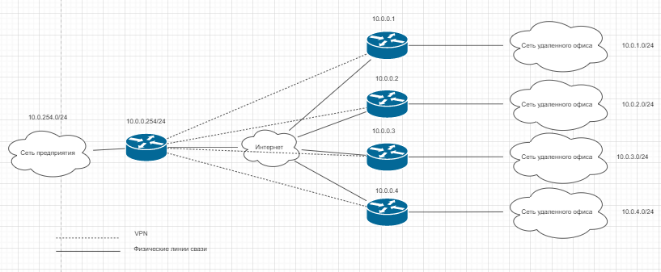

# ДЗ 3.8

## 1. Подключитесь к публичному маршрутизатору в интернет. Найдите маршрут к вашему публичному IP
```
route-views>show ip route 37.145.xx.xxx
Routing entry for 37.145.xx.0/21
  Known via "bgp 6447", distance 20, metric 0
  Tag 6939, type external
  Last update from 64.71.137.241 4d05h ago
  Routing Descriptor Blocks:
  * 64.71.137.241, from 64.71.137.241, 4d05h ago
      Route metric is 0, traffic share count is 1
      AS Hops 3
      Route tag 6939
      MPLS label: none
```
```
route-views>show bgp 37.145.xx.xxx
BGP routing table entry for 37.145.xx.0/21, version 1400924938
Paths: (23 available, best #9, table default)
  Not advertised to any peer
  Refresh Epoch 1
  20130 6939 3216 8402, (aggregated by 64517 78.107.138.12)
    140.192.8.16 from 140.192.8.16 (140.192.8.16)
      Origin IGP, localpref 100, valid, external
      path 7FE039672BD0 RPKI State not found
      rx pathid: 0, tx pathid: 0
  Refresh Epoch 1
  3356 3216 8402, (aggregated by 64517 78.107.138.12)
    4.68.4.46 from 4.68.4.46 (4.69.184.201)
      Origin IGP, metric 0, localpref 100, valid, external
      Community: 3216:2001 3216:4471 3356:2 3356:22 3356:100 3356:123 3356:503 3356:903 3356:2067 8402:1033
      path 7FE00B679F78 RPKI State not found
      rx pathid: 0, tx pathid: 0
...
  Refresh Epoch 1
  1351 6939 3216 8402, (aggregated by 64517 78.107.138.12)
    132.198.255.253 from 132.198.255.253 (132.198.255.253)
      Origin IGP, localpref 100, valid, external
      path 7FE13E897068 RPKI State not found
      rx pathid: 0, tx pathid: 0
```
## 2. Создайте dummy0 интерфейс в Ubuntu. Добавьте несколько статических маршрутов. Проверьте таблицу маршрутизации.
- Модуль
```
echo "dummy" > /etc/modules-load.d/dummy.conf
echo "options dummy numdummies=2" > /etc/modprobe.d/dummy.conf
```
- Настройка через systemd
```
cat << "EOF" >> /etc/systemd/network/10-dummy0.netdev
[NetDev]
Name=dummy0
Kind=dummy
EOF
cat << "EOF" >> /etc/systemd/network/20-dummy0.network
[Match]
Name=dummy0

[Network]
Address=172.16.15.1/24
EOF
```
- Перезапуск сети
```
systemctl restart systemd-networkd
```

- Статический маршрут
```
eth1:
      optional: true
      addresses:
        - 172.16.15.1/24
      routes:
        - to: 172.16.16.0/24
          via: 172.16.15.254
```
- Проверка маршрута
```
ip ro | grep stat
172.16.16.0/24 via 172.16.15.254 dev eth1 proto static
```
## 3. Проверьте открытые TCP порты в Ubuntu, какие протоколы и приложения используют эти порты? Приведите несколько примеров.
TCP:
```
ss -tnlp
State     Recv-Q    Send-Q       Local Address:Port       Peer Address:Port   Process
LISTEN    0         4096         127.0.0.53%lo:53              0.0.0.0:*       users:(("systemd-resolve",pid=576,fd=13))
LISTEN    0         128                0.0.0.0:22              0.0.0.0:*       users:(("sshd",pid=1197,fd=3))
LISTEN    0         128                   [::]:22                 [::]:*       users:(("sshd",pid=1197,fd=4))
```
Примеры:
- 53 порт - DNS
- 22 порт - SSH
## 4. Проверьте используемые UDP сокеты в Ubuntu, какие протоколы и приложения используют эти порты?
UDP:
```
ss -unap
State    Recv-Q   Send-Q           Local Address:Port      Peer Address:Port   Process
UNCONN   0        0                127.0.0.53%lo:53             0.0.0.0:*       users:(("systemd-resolve",pid=576,fd=12))
UNCONN   0        0          192.168.255.10%eth1:68             0.0.0.0:*       users:(("systemd-network",pid=1516,fd=26))
```
Порты:
- 53 порт - DNS.
- 68 порт - DHCP для отправки сообщений клиентам

## 5. Используя diagrams.net, создайте L3 диаграмму вашей домашней сети или любой другой сети, с которой вы работали.

