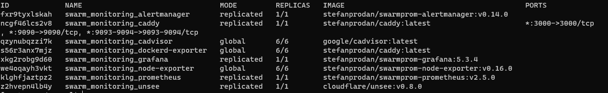

## Задача 1

Дайте письменые ответы на следующие вопросы:

- В чём отличие режимов работы сервисов в Docker Swarm кластере: replication и global?
>replication -   Для реплицируемой службы вы указываете количество идентичных задач,  
> которые хотите запустить. Например, вы решили развернуть службу HTTP с тремя репликами,  
> каждая из которых обслуживает один и тот же контент
 
> global  это служба, которая запускает одну задачу на каждом узле.  
> Заранее заданного количества заданий нет. Каждый раз, когда вы добавляете узел в,  
> оркестратор создает задачу, а планировщик назначает задачу новому узлу.

- Какой алгоритм выбора лидера используется в Docker Swarm кластере?
>если Лидер-менеджер, который отвечает за планирование задач в кластере, неожиданно умирает,
любой другой менеджер может взять на себя задачу планирования и перебалансировки задач, 
чтобы соответствовать желаемому состоянию.
> Количество управляющих узлов не ограничено. Решение о том, сколько узлов менеджера реализовать,
> является компромиссом между производительностью и отказоустойчивостью. Добавление управляющих узлов в рой делает 
> sworm более отказоустойчивым.
> Однако дополнительные узлы-менеджеры снижают производительность записи

- Что такое Overlay Network?
>Создает распределенную сеть между несколькими узлами Docker. Эта сеть находится поверх сети хоста, позволяя контейнерам,   
> подключенным к ней (включая контейнеры службы swarm), безопасно обмениваться данными при включенном шифровании

## Задача 2

Создать ваш первый Docker Swarm кластер в Яндекс.Облаке 
>terraform init  
>terraform plan  
> terraform validate  
> terraform apply -auto-approve

Получил ошибку 
[WARNING]: Ansible is being run in a world writable directory  
 

Для решения проблемы скопировал примонтированную папку с конфигурацией в домашнюю директорию  
>cp -r /vagrant/05-virt-05-docker-swarm ~//05-virt-05-docker-swarm   


Подключаемся к node01
>ssh centos@51.250.65.15  

Для получения зачета, вам необходимо предоставить скриншот из терминала (консоли), с выводом команды:
```
sudo docker node ls
```

## Задача 3

Создать ваш первый, готовый к боевой эксплуатации кластер мониторинга, состоящий из стека микросервисов.

Для получения зачета, вам необходимо предоставить скриншот из терминала (консоли), с выводом команды:
```
sudo docker service ls
```

## Задача 4 (*)

Выполнить на лидере Docker Swarm кластера команду (указанную ниже) и дать письменное описание её функционала, что она делает и зачем она нужна:
```
# см.документацию: https://docs.docker.com/engine/swarm/swarm_manager_locking/
docker swarm update --autolock=true
```

```
Docker может защитить общий ключ шифрования TLS и ключ, используемый для шифрования и расшифровки журналов Raft в 
состоянии покоя, позволяя вам стать владельцем этих ключей и требовать ручной разблокировки ваших менеджеров.
Эта функция называется автоблокировкой 
```


https://docs.docker.com/engine/reference/commandline/swarm_init/   
https://docs.docker.com/engine/swarm/admin_guide/

