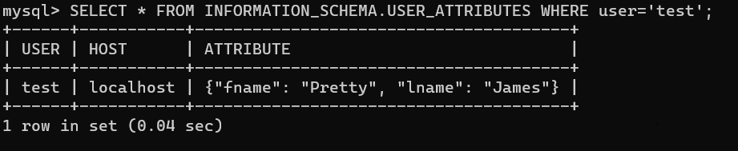

# Домашнее задание к занятию "6.3. MySQL"

## Введение

Перед выполнением задания вы можете ознакомиться с 
[дополнительными материалами](https://github.com/netology-code/virt-homeworks/tree/master/additional/README.md).

## Задача 1
>cp /vagrant/06-db-03-mysql/ ~ -r

Используя docker поднимите инстанс MySQL (версию 8). Данные БД сохраните в volume.
``` 
version: '3.1'

services:

  db:
    image: mysql:8.0
    command: --default-authentication-plugin=mysql_native_password
    restart: always
    environment:
      MYSQL_ROOT_PASSWORD: "p@ssw0rd"
    volumes:
      - /mnt/mysql-external-backup:/mysql-external-backup
      - /mnt/mysql-backup:/mysql-backup
    ports:
      - "5432:5432"

  adminer:
    image: adminer
    restart: always
    environment:
      ADMINER_DEFAULT_SERVER: db
      ADMINER_DESIGN: nette
    ports:
      - 8080:8080
```

Изучите [бэкап БД](https://github.com/netology-code/virt-homeworks/tree/master/06-db-03-mysql/test_data) и 
восстановитесь из него.
```
sudo wget https://raw.githubusercontent.com/netology-code/virt-homeworks/master/06-db-03-mysql/test_data/test_dump.sql
mysql < test_dump.sql -uroot -p test_db
```
Перейдите в управляющую консоль `mysql` внутри контейнера.
```
sudo docker-compose up -d 
sudo docker-compose ps
```

```
sudo docker exec -it src_db_1 bash

mysql -uroot -p

```
Используя команду `\h` получите список управляющих команд.

Найдите команду для выдачи статуса БД и **приведите в ответе** из ее вывода версию сервера БД.
```
\s
```

Подключитесь к восстановленной БД и получите список таблиц из этой БД.
``` 
connect test_db;
show tables;
```
**Приведите в ответе** количество записей с `price` > 300.
``` 
SELECT * FROM orders;
SELECT * FROM orders WHERE price >300;
```

В следующих заданиях мы будем продолжать работу с данным контейнером.

## Задача 2

Создайте пользователя test в БД c паролем test-pass, используя:
- плагин авторизации mysql_native_password
- срок истечения пароля - 180 дней 
- количество попыток авторизации - 3 
- максимальное количество запросов в час - 100
- аттрибуты пользователя:
    - Фамилия "Pretty"
    - Имя "James"
``` 
create user 'test'@'localhost' identified with mysql_native_password by 'test-pass' password expire interval 180 day failed_login_attempts 3 attribute '{"fname": "Pretty", "lname": "James"}';
alter user 'test'@'localhost' with max_queries_per_hour 100;
grant select on test_db.* to 'test'@'localhost';
```

Предоставьте привелегии пользователю `test` на операции SELECT базы `test_db`.
 ``` 
 GRANT SELECT ON test_db.* TO 'test'@'localhost';
 ```   
Используя таблицу INFORMATION_SCHEMA.USER_ATTRIBUTES получите данные по пользователю `test` и 
``` 
 SELECT * FROM INFORMATION_SCHEMA.USER_ATTRIBUTES WHERE user='test';
```


**приведите в ответе к задаче**.

## Задача 3

Установите профилирование `SET profiling = 1`.

Изучите вывод профилирования команд `SHOW PROFILES;`.

Исследуйте, какой `engine` используется в таблице БД `test_db` и **приведите в ответе**.
``` 
SELECT TABLE_NAME, ENGINE FROM information_schema.TABLES WHERE TABLE_SCHEMA = 'test_db';
```


Измените `engine` и **приведите время выполнения и запрос на изменения из профайлера в ответе**:
- на `MyISAM`
- на `InnoDB`
```
ALTER TABLE orders ENGINE=MyISAM;
```

```
ALTER TABLE orders ENGINE=InnoDB;
```


## Задача 4 

Изучите файл `my.cnf` в директории /etc/mysql.

Измените его согласно ТЗ (движок InnoDB):
- Скорость IO важнее сохранности данных
- Нужна компрессия таблиц для экономии места на диске
- Размер буффера с незакомиченными транзакциями 1 Мб
- Буффер кеширования 30% от ОЗУ
- Размер файла логов операций 100 Мб

Приведите в ответе измененный файл `my.cnf`.
``` 
cat /etc/mysql/my.cnf
для удобного редактирования файла пришлось установить nano  в контейнер
```


---

### Как оформить ДЗ?

Выполненное домашнее задание пришлите ссылкой на .md-файл в вашем репозитории.

---
