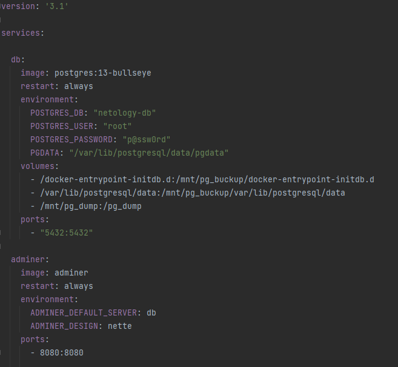
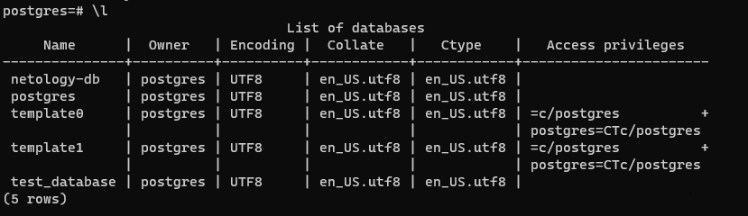
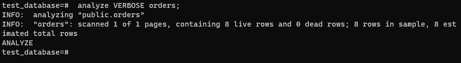
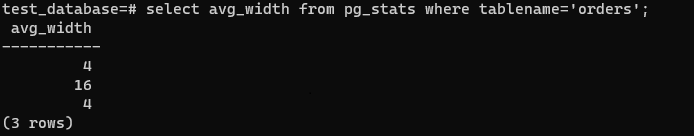

# Домашнее задание к занятию "6.4. PostgreSQL"

## Задача 1

Используя docker поднимите инстанс PostgreSQL (версию 13). Данные БД сохраните в volume.

Подключитесь к БД PostgreSQL используя `psql`.
``` 
 sudo docker exec -it src_db_1 psql -U postgres
```
Воспользуйтесь командой `\?` для вывода подсказки по имеющимся в `psql` управляющим командам.

**Найдите и приведите** управляющие команды для:
- вывода списка БД
>\l
- подключения к БД
>\c[onnect] {[DBNAME|- USER|- HOST|- PORT|-] | conninfo}
- вывода списка таблиц
>\dl
- вывода описания содержимого таблиц
>\dS+ table_name
- выхода из psql
>\q

## Задача 2

Используя `psql` создайте БД `test_database`.
>create database test_database;

Изучите [бэ:п БД](https://github.com/netology-code/virt-homeworks/tree/master/06-db-04-postgresql/test_data).

Восстановите бэкап БД в `test_database`.
>sudo wget https://raw.githubusercontent.com/netology-code/virt-homeworks/master/06-db-04-postgresql/test_data/test_dump.sql
> sudo docker exec -it src_db_1 bash
> cd /pg_dump/
>psql -U postgres -d test_database < test_dump.sql



Перейдите в управляющую консоль `psql` внутри контейнера.
> sudo docker exec -it src_db_1 psql -U postgres

Подключитесь к восстановленной БД и проведите операцию ANALYZE для сбора статистики по таблице.
>\c test_database
> analyze VERBOSE orders;



Используя таблицу [pg_stats](https://postgrespro.ru/docs/postgresql/12/view-pg-stats), найдите столбец таблицы `orders` 
с наибольшим средним значением размера элементов в байтах.

**Приведите в ответе** команду, которую вы использовали для вычисления и полученный результат.
>select avg_width from pg_stats where tablename='orders';



## Задача 3

Архитектор и администратор БД выяснили, что ваша таблица orders разрослась до невиданных размеров и
поиск по ней занимает долгое время. Вам, как успешному выпускнику курсов DevOps в нетологии предложили
провести разбиение таблицы на 2 (шардировать на orders_1 - price>499 и orders_2 - price<=499).

Предложите SQL-транзакцию для проведения данной операции.
``` 
test_database=# create table orders_1 (check ( price > 499 )) inherits ( orders );
CREATE TABLE
test_database=# create table orders_2 (check ( price <= 499 )) inherits ( orders );
CREATE TABLE
test_database=# create rule order_price_more_499 as on insert to orders where ( price > 499 ) do instead insert into orders_1 values (new.*);
CREATE RULE
test_database=# create rule order_price_less_499 as on insert to orders where ( price <= 499 ) do instead insert into orders_2 values (new.*);
CREATE RULE
```

Можно ли было изначально исключить "ручное" разбиение при проектировании таблицы orders?
>Можно было настроить разбиение таблици изначально
## Задача 4

Используя утилиту `pg_dump` создайте бекап БД `test_database`.
>psql -U postgres -W test_database > backup_test_database.sql

Как бы вы доработали бэкап-файл, чтобы добавить уникальность значения столбца `title` для таблиц `test_database`?
>необходмио добавить слово UNIQUE к нужному столбцу [link](https://www.postgresql.org/docs/9.4/ddl-constraints.html)

``` 
	CREATE TABLE public.orders (  
	    id integer NOT NULL,  
	    title character varying(80) NOT NULL,  
	    price integer DEFAULT 0,  
	    UNIQUE (title)  
	);  
```
---

### Как cдавать задание

Выполненное домашнее задание пришлите ссылкой на .md-файл в вашем репозитории.

---
