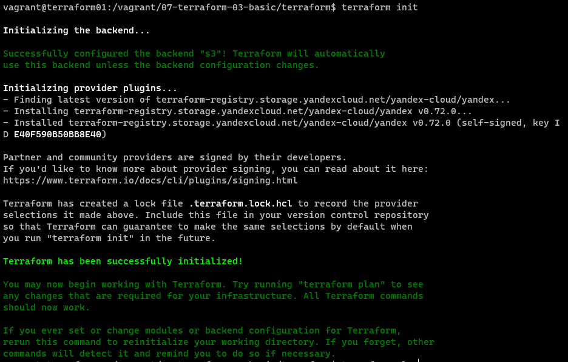
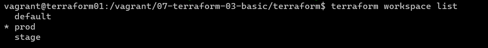

# Домашнее задание к занятию "7.3. Основы и принцип работы Терраформ"

## Задача 1. Создадим бэкэнд в S3 (необязательно, но крайне желательно).

Если в рамках предыдущего задания у вас уже есть аккаунт AWS, то давайте продолжим знакомство со взаимодействием
терраформа и aws. 

1. Создайте s3 бакет, iam роль и пользователя от которого будет работать терраформ. Можно создать отдельного пользователя,
а можно использовать созданного в рамках предыдущего задания, просто добавьте ему необходимы права, как описано 
[здесь](https://www.terraform.io/docs/backends/types/s3.html).
[YC backends](https://cloud.yandex.ru/docs/tutorials/infrastructure-management/terraform-state-storage#create-service-account)
2. Зарегистрируйте бэкэнд в терраформ проекте как описано по ссылке выше. 


## Задача 2. Инициализируем проект и создаем воркспейсы. 

1. Выполните `terraform init`:
    * если был создан бэкэнд в S3, то терраформ создат файл стейтов в S3 и запись в таблице 
dynamodb.
    * иначе будет создан локальный файл со стейтами.  


2. Создайте два воркспейса `stage` и `prod`.
```
terraform workspace new stage
terraform workspace new prod
```
3. В уже созданный `aws_instance` добавьте зависимость типа инстанса от вокспейса, что бы в разных ворскспейсах 
использовались разные `instance_type`.
4. Добавим `count`. Для `stage` должен создаться один экземпляр `ec2`, а для `prod` два. 
5. Создайте рядом еще один `aws_instance`, но теперь определите их количество при помощи `for_each`, а не `count`.
6. Что бы при изменении типа инстанса не возникло ситуации, когда не будет ни одного инстанса добавьте параметр
жизненного цикла `create_before_destroy = true` в один из рессурсов `aws_instance`.
7. При желании поэкспериментируйте с другими параметрами и рессурсами.

В виде результата работы пришлите:
* Вывод команды `terraform workspace list`.

* Вывод команды `terraform plan` для воркспейса `prod`.  
``` 
 # yandex_compute_instance.vm-2["prod"] will be created
  + resource "yandex_compute_instance" "vm-2" {
      + created_at                = (known after apply)
      + folder_id                 = (known after apply)
      + fqdn                      = (known after apply)
      + hostname                  = (known after apply)
      + id                        = (known after apply)
      + metadata                  = {
          + "ssh-keys" = <<-EOT
                #cloud-config
                users:
                  - name: vagrant
                    groups: sudo
                    shell: /bin/bash
                    sudo: ['ALL=(ALL) NOPASSWD:ALL']
                    ssh_authorized_keys:
                SHA256:O853JyHi5gt8FWHDCbWta6StTT9aQLXQdNXX4f+WoM0 vagrant@terraform01
            EOT
        }
      + name                      = "terraform-netology"
      + network_acceleration_type = "standard"
      + platform_id               = "standard-v1"
      + service_account_id        = (known after apply)
      + status                    = (known after apply)
      + zone                      = (known after apply)

      + boot_disk {
          + auto_delete = true
          + device_name = (known after apply)
          + disk_id     = (known after apply)
          + mode        = (known after apply)

          + initialize_params {
              + block_size  = (known after apply)
              + description = (known after apply)
              + image_id    = "fd8iqd03vink8hs1nppp"
              + name        = (known after apply)
              + size        = (known after apply)
              + snapshot_id = (known after apply)
              + type        = "network-hdd"
            }
        }

      + network_interface {
          + index              = (known after apply)
          + ip_address         = (known after apply)
          + ipv4               = true
          + ipv6               = (known after apply)
          + ipv6_address       = (known after apply)
          + mac_address        = (known after apply)
          + nat                = true
          + nat_ip_address     = (known after apply)
          + nat_ip_version     = (known after apply)
          + security_group_ids = (known after apply)
          + subnet_id          = (known after apply)
        }

      + placement_policy {
          + placement_group_id = (known after apply)
        }

      + resources {
          + core_fraction = 100
          + cores         = 2
          + memory        = 2
        }

      + scheduling_policy {
          + preemptible = (known after apply)
        }
    }
```

---

### Как cдавать задание

Выполненное домашнее задание пришлите ссылкой на .md-файл в вашем репозитории.

---
