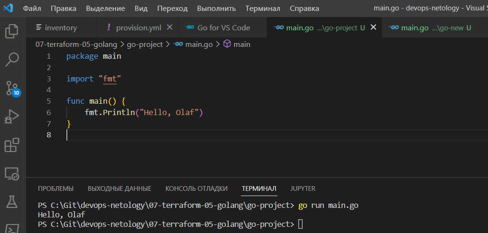
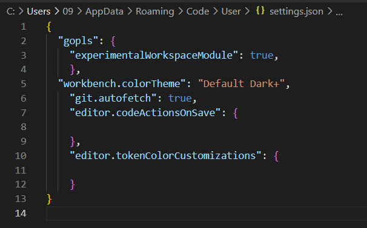
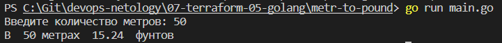
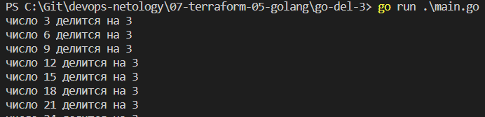

# Домашнее задание к занятию "7.5. Основы golang"

С `golang` в рамках курса, мы будем работать не много, поэтому можно использовать любой IDE. 
Но рекомендуем ознакомиться с [GoLand](https://www.jetbrains.com/ru-ru/go/).  

```Для коррекнтой работы в VSCode изменил settings.json
{
  "gopls": {
    "experimentalWorkspaceModule": true,
    }, 
```


## Задача 1. Установите golang.
1. Воспользуйтесь инструкций с официального сайта: [https://golang.org/](https://golang.org/).
2. Так же для тестирования кода можно использовать песочницу: [https://play.golang.org/](https://play.golang.org/).

>sudo apt install golang


## Задача 2. Знакомство с gotour.
У Golang есть обучающая интерактивная консоль [https://tour.golang.org/](https://tour.golang.org/). 
Рекомендуется изучить максимальное количество примеров. В консоли уже написан необходимый код, 
осталось только с ним ознакомиться и поэкспериментировать как написано в инструкции в левой части экрана.  

## Задача 3. Написание кода. 
Цель этого задания закрепить знания о базовом синтаксисе языка. Можно использовать редактор кода 
на своем компьютере, либо использовать песочницу: [https://play.golang.org/](https://play.golang.org/).

1. Напишите программу для перевода метров в футы (1 фут = 0.3048 метр). Можно запросить исходные данные 
у пользователя, а можно статически задать в коде.
    Для взаимодействия с пользователем можно использовать функцию `Scanf`:
    ```
    package main
    
    import "fmt"
    
    func main() {
        fmt.Print("Введите количество метров: ")
        var input float64
        fmt.Scanf("%f", &input)
    
        output := input * 0.3048
    
        fmt.Println("В " input "метрах " output " фунтов")    
    }
    ```
 ``` 
1. создаем димррикторрию с проектом   
2. инициализируем модуль   
>go mod init metr-to-pound
3. запускаем файл
>go run main.go
```
``` 
  package main
    
    import "fmt"
    
    func main() {
        fmt.Print("Введите количество метров: ")
        var input float64
        fmt.Scanf("%f", &input)
    
        output := input * 0.3048
    
        fmt.Println("В " input "метрах " output " фунтов")    
    }
```


1. Напишите программу, которая найдет наименьший элемент в любом заданном списке, например:
    ```
    x := []int{48,96,86,68,57,82,63,70,37,34,83,27,19,97,9,17,}
    ```
   
```python
package main

import (
	"fmt"
	"sort"
)

func main() {
	x := []int{48, 96, 86, 68, 57, 82, 63, 70, 37, 34, 83, 27, 19, 97, 9, 17}
	// Отсортировать и взять последний элемент
	sort.Ints(x)
	fmt.Println("максимальный элемент методом сортировки: ", x[len(x)-1])

	// Или через цикл
	max := x[0]
	for _, element := range x {
		if element > max {
			max = element
		}
	}

	fmt.Println("максимальный элемент через цикл: ", max)

	min := x[0]
	for _, element := range x {
		if element < min {
			min = element
		}
	}

	fmt.Println("минимальный элемент через цикл: ", min)
}

```
1. Напишите программу, которая выводит числа от 1 до 100, которые делятся на 3. То есть `(3, 6, 9, …)`.

```python
package main

import (
	"fmt"
)

func main() {
	a := makeRange(1, 100)
	for _, value := range a {
		res := value % 3
		if res < 1 {
			fmt.Println("число",value, "делится на 3")
		}

	}
}

func makeRange(min, max int) []int {
	a := make([]int, max-min+1)
	for i := range a {
		a[i] = min + i
	}
	return a
}

```
```
не удалось вывести в список типа `(3, 6, 9, …)` 
```
   
В виде решения ссылку на код или сам код. 

## Задача 4. Протестировать код (не обязательно).

Создайте тесты для функций из предыдущего задания. 

---

### Как cдавать задание

Выполненное домашнее задание пришлите ссылкой на .md-файл в вашем репозитории.

---

