# Домашнее задание к занятию "08.01 Введение в Ansible"

## Подготовка к выполнению
1. Установите ansible версии 2.10 или выше.
[install ansible](https://docs.ansible.com/ansible/latest/installation_guide/intro_installation.html)
```python
v1
curl https://bootstrap.pypa.io/get-pip.py -o get-pip.py
python3 get-pip.py --user
python3 -m pip install --user ansible
or 
python3 -m pip install --user ansible-core==2.12.3

python3 -m pip -V
v2
sudo apt-get install epel-release
sudo apt-get install ansible
```
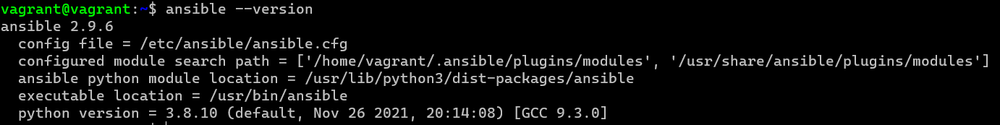

2. Создайте свой собственный публичный репозиторий на github с произвольным именем.
3. Скачайте [playbook](./playbook/) из репозитория с домашним заданием и перенесите его в свой репозиторий.

## Основная часть
1. Попробуйте запустить playbook на окружении из `test.yml`, зафиксируйте какое значение имеет факт `some_fact` для указанного хоста при выполнении playbook'a.
>sudo ansible-playbook -i inventory/test.yml site.yml

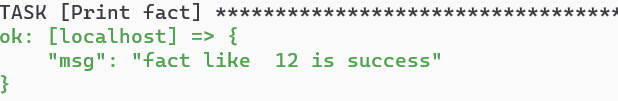
2. Найдите файл с переменными (group_vars) в котором задаётся найденное в первом пункте значение и поменяйте его на 'all default fact'.
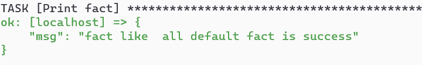
3. Воспользуйтесь подготовленным (используется `docker`) или создайте собственное окружение для проведения дальнейших испытаний.
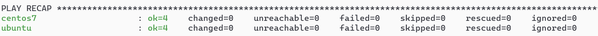
4. Проведите запуск playbook на окружении из `prod.yml`. Зафиксируйте полученные значения `some_fact` для каждого из `managed host`.
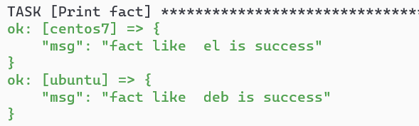
5. Добавьте факты в `group_vars` каждой из групп хостов так, чтобы для `some_fact` получились следующие значения: для `deb` - 'deb default fact', для `el` - 'el default fact'.
6. Повторите запуск playbook на окружении `prod.yml`. Убедитесь, что выдаются корректные значения для всех хостов.
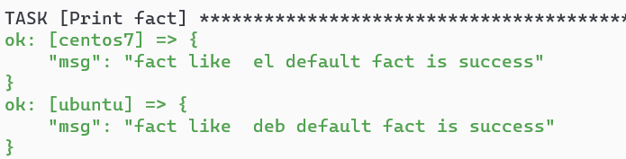
8. При помощи `ansible-vault` зашифруйте факты в `group_vars/deb` и `group_vars/el` с паролем `netology`.
```
ansible-vault encrypt group_vars/deb/custom.yml - зашифровать
ansible-vault view group_vars/el/examp.yml - просмотреть файл
ansible-vault edit group_vars/el/examp.yml - редактировать
ansible-vault rekey group_vars/el/examp.yml - изменить ключ
ansible-vault decrypt group_vars/el/examp.yml - расшифровать
ansible-vault encrypt_string - создание переменной зашифрованной

```
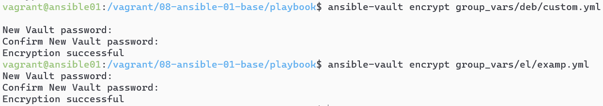
9. Запустите playbook на окружении `prod.yml`. При запуске `ansible` должен запросить у вас пароль. Убедитесь в работоспособности.
>sudo ansible-playbook -i inventory/prod.yml site.yml --ask-vault-pass
10. Посмотрите при помощи `ansible-doc` список плагинов для подключения. Выберите подходящий для работы на `control node`.
```
ansible-doc -t connection -l
ansible-doc -t connection local
```
11. В `prod.yml` добавьте новую группу хостов с именем  `local`, в ней разместите localhost с необходимым типом подключения.
12. Запустите playbook на окружении `prod.yml`. При запуске `ansible` должен запросить у вас пароль. Убедитесь что факты `some_fact` для каждого из хостов определены из верных `group_vars`.
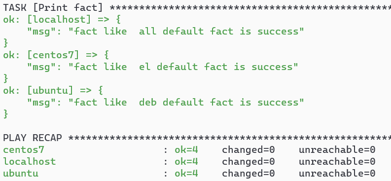
13. Заполните `README.md` ответами на вопросы. Сделайте `git push` в ветку `master`. В ответе отправьте ссылку на ваш открытый репозиторий с изменённым `playbook` и заполненным `README.md`.

## Необязательная часть

1. При помощи `ansible-vault` расшифруйте все зашифрованные файлы с переменными.
>ansible-vault decrypt group_vars/el/examp.yml 
2. Зашифруйте отдельное значение `PaSSw0rd` для переменной `some_fact` паролем `netology`. Добавьте полученное значение в `group_vars/all/exmp.yml`.
```
ansible-vault encrypt_string 
```
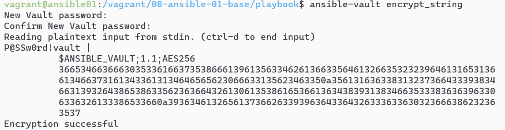
4. Запустите `playbook`, убедитесь, что для нужных хостов применился новый `fact`.
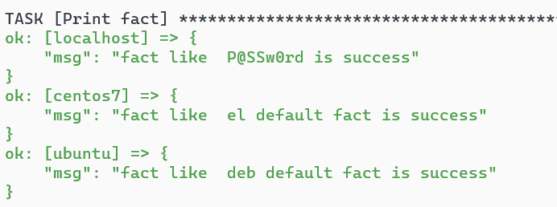
5. Добавьте новую группу хостов `fedora`, самостоятельно придумайте для неё переменную. В качестве образа можно использовать [этот](https://hub.docker.com/r/pycontribs/fedora).
 ```
sudo docker pull pycontribs/fedora
sudo docker images
sudo docker run --name fedora -d c31790496329 sleep 60000000
sudo docker ps
```
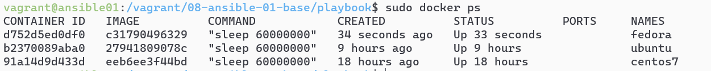
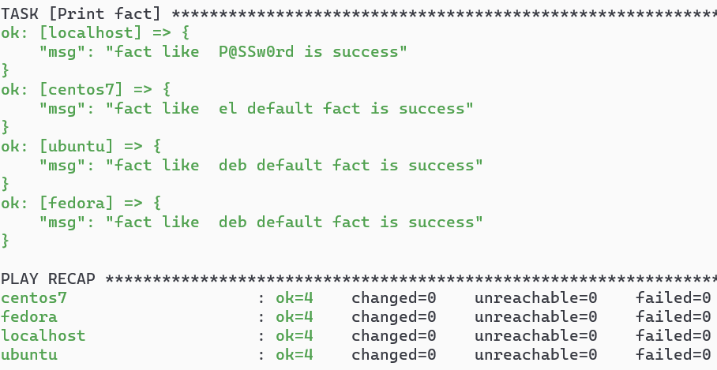
6. Напишите скрипт на bash: автоматизируйте поднятие необходимых контейнеров, запуск ansible-playbook и остановку контейнеров.
```
затрудняюсь с данным заданием
```
7. Все изменения должны быть зафиксированы и отправлены в вашей личный репозиторий.

---

### Как оформить ДЗ?

Выполненное домашнее задание пришлите ссылкой на .md-файл в вашем репозитории.

---
```python
#просмотр справки
ansible-doc -t connection -l
ansible-doc -t module -l
#тестирование кода на ошибки
ansible-lint site.yml
ansible-inventory -i inventory/prod.yml --list
ansible-inventory -i inventory/prod.yml --host ubuntu

```
