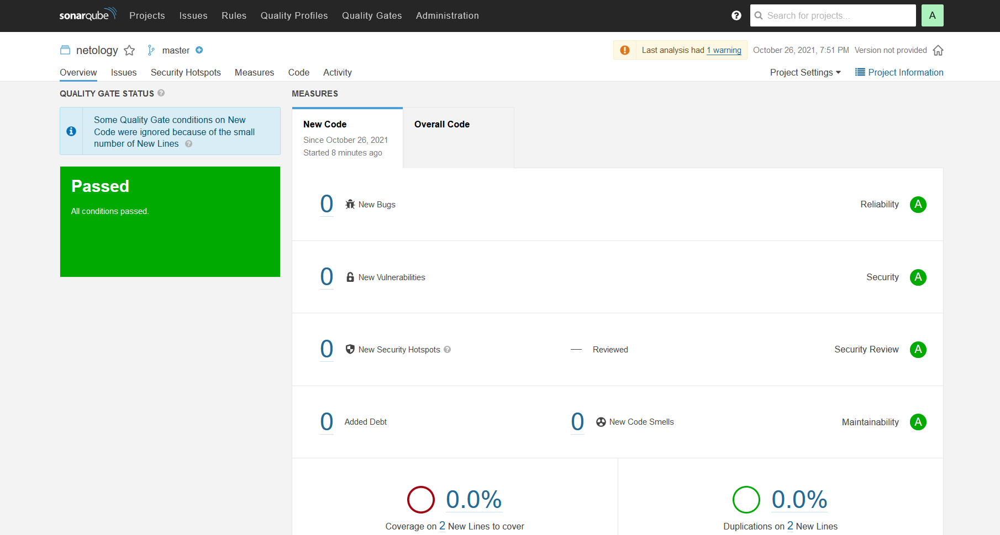

# Ответы на домашнее задание к занятию "09.02 CI\CD"

## Знакомство с SonarQube

### Подготовка к выполнению

1. Выполняем `docker pull sonarqube:8.7-community`
2. Выполняем `docker run -d --name sonarqube -e SONAR_ES_BOOTSTRAP_CHECKS_DISABLE=true -p 9000:9000 sonarqube:8.7-community`
3. Ждём запуск, смотрим логи через `docker logs -f sonarqube`
4. Проверяем готовность сервиса через [браузер](http://localhost:9000)
5. Заходим под admin\admin, меняем пароль на свой

В целом, в [этой статье](https://docs.sonarqube.org/latest/setup/install-server/) описаны все варианты установки, включая и docker, но так как нам он нужен разово, то достаточно того набора действий, который я указал выше.

### Основная часть

1. Создаём новый проект, название произвольное
2. Скачиваем пакет sonar-scanner, который нам предлагает скачать сам sonarqube

```text
# Источник: https://docs.sonarqube.org/latest/analysis/scan/sonarscanner/
# Для Linux:
wget https://binaries.sonarsource.com/Distribution/sonar-scanner-cli/sonar-scanner-cli-4.6.2.2472-linux.zip
```

3. Делаем так, чтобы binary был доступен через вызов в shell (или меняем переменную PATH или любой другой удобный вам способ)

```bash
cd /home/dockeruser/docker/sonar-scanner-4.6.2.2472-linux/bin
export PATH=$PATH:$(pwd)
```

4. Проверяем `sonar-scanner --version`

```
# Необходимо сделать программы исполняемыми
# (/sonar-scanner-4.6.2.2472-linux/bin/sonar-scanner и /sonar-scanner-4.6.2.2472-linux/jre/bin/java)
sonar-scanner --version
INFO: Scanner configuration file: /home/dockeruser/docker/sonar-scanner-4.6.2.2472-linux/conf/sonar-scanner.properties
INFO: Project root configuration file: NONE
INFO: SonarScanner 4.6.2.2472
INFO: Java 11.0.11 AdoptOpenJDK (64-bit)
INFO: Linux 5.4.0-89-generic amd64
```

5. Запускаем анализатор против кода из директории [example](./example) с дополнительным ключом `-Dsonar.coverage.exclusions=fail.py`

```bash
sonar-scanner \
  -Dsonar.projectKey=netology \
  -Dsonar.sources=. \
  -Dsonar.host.url=http://localhost:9000 \
  -Dsonar.login=fd139acfd5229c9e3ca45330606b04634ec2f156 \
  -Dsonar.coverage.exclusions=fail.py
```

6. Смотрим результат в интерфейсе
7. Исправляем ошибки, которые он выявил (включая warnings)
8. Запускаем анализатор повторно - проверяем, что QG пройдены успешно
9. Делаем скриншот успешного прохождения анализа, прикладываем к решению ДЗ

Screenshot:




## Знакомство с Nexus

### Подготовка к выполнению

1. Выполняем `docker pull sonatype/nexus3`
2. Выполняем `docker run -d -p 8081:8081 --name nexus sonatype/nexus3`
3. Ждём запуск, смотрим логи через `docker logs -f nexus`
4. Проверяем готовность сервиса через [бразуер](http://localhost:8081)
5. Узнаём пароль от admin через `docker exec -it nexus /bin/bash`
6. Подключаемся под админом, меняем пароль, сохраняем анонимный доступ

### Основная часть

1. В репозиторий `maven-public` загружаем артефакт с GAV параметрами:
   1. groupId: netology
   2. artifactId: java
   3. version: 8_282
   4. classifier: distrib
   5. type: tar.gz
2. В него же загружаем такой же артефакт, но с version: 8_102
3. Проверяем, что все файлы загрузились успешно
4. В ответе присылаем файл `maven-metadata.xml` для этого артефекта

```xml
<metadata modelVersion="1.1.0">
   <groupId>netology</groupId>
   <artifactId>java</artifactId>
   <versioning>
      <latest>8_282</latest>
      <release>8_282</release>
      <versions>
         <version>8_102</version>
         <version>8_282</version>
      </versions>
      <lastUpdated>20211026193228</lastUpdated>
   </versioning>
</metadata>
```

### Знакомство с Maven

### Подготовка к выполнению

1. Скачиваем дистрибутив с [maven](https://maven.apache.org/download.cgi)

```bash
wget https://dlcdn.apache.org/maven/maven-3/3.8.3/binaries/apache-maven-3.8.3-bin.tar.gz
```

2. Разархивируем, делаем так, чтобы binary был доступен через вызов в shell (или меняем переменную PATH или любой другой удобный вам способ)

```bash
cd /home/dockeruser/docker/apache-maven-3.8.3/bin/
export PATH=$PATH:$(pwd)
```

3. Проверяем `mvn --version`

```bash
mvn --version
Apache Maven 3.8.3 (ff8e977a158738155dc465c6a97ffaf31982d739)
Maven home: /home/dockeruser/docker/apache-maven-3.8.3
Java version: 11, vendor: Oracle Corporation, runtime: /opt/jdk/openjdk-11
Default locale: en_US, platform encoding: UTF-8
OS name: "linux", version: "5.4.0-89-generic", arch: "amd64", family: "unix"
```

4. Забираем директорию [mvn](./mvn) с pom

### Основная часть

1. Меняем в `pom.xml` блок с зависимостями под наш артефакт из первого пункта задания для Nexus (java с версией 8_282)
2. Запускаем команду `mvn package` в директории с `pom.xml`, ожидаем успешного окончания
3. Проверяем директорию `~/.m2/repository/`, находим наш артефакт

```bash
ls ~/.m2/repository/netology/java/8_282/
java-8_282-distrib.tar.gz       java-8_282.pom       _remote.repositories
java-8_282-distrib.tar.gz.sha1  java-8_282.pom.sha1
```

4. В ответе присылаем исправленный файл `pom.xml`

```xml
<project xmlns="http://maven.apache.org/POM/4.0.0" xmlns:xsi="http://www.w3.org/2001/XMLSchema-instance"
  xsi:schemaLocation="http://maven.apache.org/POM/4.0.0 http://maven.apache.org/xsd/maven-4.0.0.xsd">
  <modelVersion>4.0.0</modelVersion>

  <groupId>com.netology.app</groupId>
  <artifactId>simple-app</artifactId>
  <version>1.0-SNAPSHOT</version>
   <repositories>
    <repository>
      <id>my-repo</id>
      <name>maven-public</name>
      <url>http://localhost:8081/repository/maven-public/</url>
    </repository>
  </repositories>
  <dependencies>
    <dependency>
      <groupId>netology</groupId>
      <artifactId>java</artifactId>
      <version>8_282</version>
      <classifier>distrib</classifier>
      <type>tar.gz</type>
    </dependency>
  </dependencies>
</project>

```
