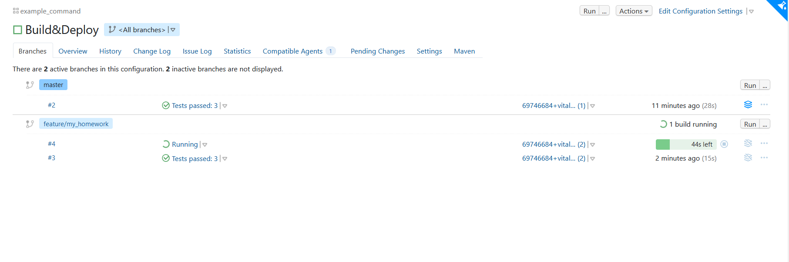

# Ответы на домашнее задание к занятию "09.05 Teamcity"

## Подготовка к выполнению

1. В Ya.Cloud создайте новый инстанс (4CPU4RAM) на основе образа `jetbrains/teamcity-server`
2. Дождитесь запуска teamcity, выполните первоначальную настройку
3. Создайте ещё один инстанс (2CPU4RAM) на основе образа `jetbrains/teamcity-agent`. Пропишите к нему переменную окружения `SERVER_URL: "http://<teamcity_url>:8111"`
4. Авторизуйте агент
5. Сделайте fork [репозитория](https://github.com/aragastmatb/example-teamcity)

```text
В подготовке инфраструктуры ничего не указано о создании инстанса (2CPU4RAM) для Nexus. Собрал на основе образа `sonatype/nexus3`.
```

## Основная часть

1. Создайте новый проект в teamcity на основе fork


2. Сделайте autodetect конфигурации


3. Сохраните необходимые шаги, запустите первую сборку master'a


4. Поменяйте условия сборки: если сборка по ветке `master`, то должен происходит `mvn clean package deploy`, иначе `mvn clean test`


5. Для deploy будет необходимо загрузить [settings.xml](./teamcity/settings.xml) в набор конфигураций maven у teamcity, предварительно записав туда креды для подключения к nexus


6. В pom.xml необходимо поменять ссылки на репозиторий и nexus
7. Запустите сборку по master, убедитесь что всё прошло успешно, артефакт появился в nexus




8. Мигрируйте `build configuration` в репозиторий
9. Создайте отдельную ветку `feature/add_reply` в репозитории

```text
Сначала создал ветку feature/my_homework, затем переименовал её в feature/add_reply
```

10. Напишите новый метод для класса Welcomer: метод должен возвращать произвольную реплику, содержащую слово `hunter`

```java
package plaindoll;

public class Welcomer{
	public String sayWelcome() {
		return "Welcome home, good hunter. What is it your desire?";
	}
	public String sayFarewell() {
		return "Farewell, good hunter. May you find your worth in waking world.";
	}
	public String saySome() {
		return "This is my some method with hunter";
	}
}
```

11. Дополните тест для нового метода на поиск слова `hunter` в новой реплике

```java
package plaindoll;

import static org.hamcrest.CoreMatchers.containsString;
import static org.junit.Assert.*;

import org.junit.Test;

public class WelcomerTest {
	
	private Welcomer welcomer = new Welcomer();

	@Test
	public void welcomerSaysWelcome() {
		assertThat(welcomer.sayWelcome(), containsString("Welcome"));
	}
	@Test
	public void welcomerSaysFarewell() {
		assertThat(welcomer.sayFarewell(), containsString("Farewell"));
	}
	@Test
	public void welcomerSaysHunter() {
		assertThat(welcomer.sayWelcome(), containsString("hunter"));
		assertThat(welcomer.sayFarewell(), containsString("hunter"));
	}
	@Test
	public void welcomerSaysSome() {
		assertThat(welcomer.saySome(), containsString("hunter"));
	}

}
```

```text
Создал отдельным методом для наглядности, хотя можно было assert добавить в существующий метод welcomerSaysHunter
```

12. Сделайте push всех изменений в новую ветку в репозиторий
13. Убедитесь что сборка самостоятельно запустилась, тесты прошли успешно


14. Внесите изменения из произвольной ветки `feature/add_reply` в `master` через `Merge`
15. Убедитесь, что нет собранного артефакта в сборке по ветке `master`
16. Настройте конфигурацию так, чтобы она собирала `.jar` в артефакты сборки
17. Проведите повторную сборку мастера, убедитесь, что сбора прошла успешно и артефакты собраны


18. Проверьте, что конфигурация в репозитории содержит все настройки конфигурации из teamcity
19. В ответ предоставьте ссылку на репозиторий

### Репозиторий:

https://github.com/panarin0290/example-teamcity
