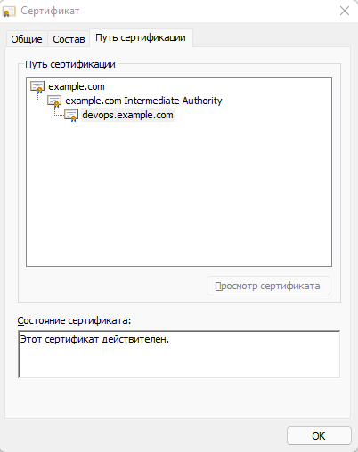

### Курсовая работа по итогам модуля "DevOps и системное администрирование"


#### 1. Создайте виртуальную машину Linux.
Файл конфигурации [Vagrantfile](Vagrantfile)

- Включаем VM ``` vagrant up ```

- Заходим по ssh ``` vagrant ssh ```

#### 2. Установите ufw и разрешите к этой машине сессии на порты 22 и 443, при этом трафик на интерфейсе localhost (lo) должен ходить свободно на все порты.
```
vagrant@vagrant:~$ sudo ufw status
vagrant@vagrant:~$ sudo ufw allow 22
vagrant@vagrant:~$ sudo ufw allow 443
vagrant@vagrant:~$ sudo ufw enable
vagrant@vagrant:~$ sudo ufw status

Status: active

To                         Action      From
--                         ------      ----
22                         ALLOW       Anywhere
443                        ALLOW       Anywhere
22 (v6)                    ALLOW       Anywhere (v6)
443 (v6)                   ALLOW       Anywhere (v6)
```
#### 3. Установите hashicorp vault (инструкция по ссылке).
```
vagrant@vagrant:~$ curl -fsSL https://apt.releases.hashicorp.com/gpg | sudo apt-key add -
OK
vagrant@vagrant:~$ sudo apt-add-repository "deb [arch=amd64] https://apt.releases.hashicorp.com $(lsb_release -cs) main"
vagrant@vagrant:~$ sudo apt-get update 
vagrant@vagrant:~$ sudo apt-get install vault
```
#### 4. Создайте центр сертификации по инструкции (ссылка), и выпустите сертификат для использования его в настройке веб-сервера nginx(срок жизни сертификата - месяц).

Запуск сервера vault в dev-режиме
```
vagrant@vagrant:~$ sudo vault server -dev
...
You may need to set the following environment variable:

    $ export VAULT_ADDR='http://127.0.0.1:8200'

The unseal key and root token are displayed below in case you want to
seal/unseal the Vault or re-authenticate.

Unseal Key: otQQ0DuV6P3IA5LLfNy1Bt2CpIf2CHuZhYsCfaBXIxE=
Root Token: s.dVrqsw0b3Zulgk9KSj8wgdbt

Development mode should NOT be used in production installations!

vagrant@vagrant:~$ sudo su

root@vagrant:/home/vagrant# export VAULT_ADDR='http://127.0.0.1:8200'

root@vagrant:/home/vagrant# export VAULT_TOKEN=s.dVrqsw0b3Zulgk9KSj8wgdbt

root@vagrant:/home/vagrant# vault status
Key             Value
---             -----
Seal Type       shamir
Initialized     true
Sealed          false
Total Shares    1
Threshold       1
Version         1.9.2
Storage Type    inmem
Cluster Name    vault-cluster-239cd0e3
Cluster ID      cd4cc488-36c0-6f65-00f5-7b718ca199d0
HA Enabled      false
```

Создание Root CA и Intermediate CA
```
root@vagrant:/home/vagrant# vault secrets enable pki
Success! Enabled the pki secrets engine at: pki/

root@vagrant:/home/vagrant# vault secrets tune -max-lease-ttl=8760h pki
Success! Tuned the secrets engine at: pki/

root@vagrant:/home/vagrant# vault write -field=certificate pki/root/generate/internal common_name="example.com" ttl=87600h > CA_cert.crt

root@vagrant:/home/vagrant# vault write pki/config/urls issuing_certificates="http://127.0.0.1:8200/v1/pki/ca" crl_distribution_points="http://127.0.0.1:8200/v1/pki/crl"
Success! Data written to: pki/config/urls

root@vagrant:/home/vagrant# vault secrets enable -path=pki_int pki
Success! Enabled the pki secrets engine at: pki_int/

root@vagrant:/home/vagrant# vault secrets tune -max-lease-ttl=8760h pki_int
Success! Tuned the secrets engine at: pki_int/

root@vagrant:/home/vagrant# apt install jq

root@vagrant:/home/vagrant# vault write -format=json pki_int/intermediate/generate/internal common_name="example.com Intermediate Authority" | jq -r '.data.csr' > pki_intermediate.csr

root@vagrant:/home/vagrant# vault write -format=json pki/root/sign-intermediate csr=@pki_intermediate.csr format=pem_bundle ttl="8760h" | jq -r '.data.certificate' > intermediate.cert.pem

root@vagrant:/home/vagrant# vault write pki_int/intermediate/set-signed certificate=@intermediate.cert.pem
Success! Data written to: pki_int/intermediate/set-signed

root@vagrant:/home/vagrant# vault write pki_int/roles/example-dot-com allowed_domains="example.com" allow_subdomains=true max_ttl="4380h"
Success! Data written to: pki_int/roles/example-dot-com

root@vagrant:/home/vagrant# vault list pki_int/roles/
Keys
----
example-dot-com
```

Создание сертификатов для devops.example.com
```
root@vagrant:/home/vagrant# vault write -format=json pki_int/issue/example-dot-com common_name="devops.example.com" ttl=720h > devops.example.com.crt

root@vagrant:/home/vagrant# cat devops.example.com.crt
....
    "private_key_type": "rsa",
    "serial_number": "7b:a9:7c:3e:9c:a5:89:65:05:dc:eb:30:2f:15:88:d2:0e:e6:57:eb"
  },
  "warnings": null
}

root@vagrant:/home/vagrant# cat devops.example.com.crt | jq -r .data.certificate > devops.example.com.crt.pem

root@vagrant:/home/vagrant# cat devops.example.com.crt | jq -r .data.issuing_ca >> devops.example.com.crt.pem

root@vagrant:/home/vagrant# cat devops.example.com.crt | jq -r .data.private_key > devops.example.com.crt.key
```
#### 5. Установите корневой сертификат созданного центра сертификации в доверенные в хостовой системе.
```
root@vagrant:/home/vagrant# ln -s /home/vagrant/CA_cert.crt /usr/local/share/ca-certificates/CA_cert.crt
root@vagrant:/home/vagrant# update-ca-certificates
Updating certificates in /etc/ssl/certs...
1 added, 0 removed; done.
Running hooks in /etc/ca-certificates/update.d...
done.
```
#### 6. Установите nginx.
```
root@vagrant:/home/vagrant# apt install nginx

root@vagrant:/home/vagrant# systemctl status nginx
● nginx.service - A high performance web server and a reverse proxy server
   Loaded: loaded (/lib/systemd/system/nginx.service; enabled; vendor preset: enabled)
   Active: active (running) since Sun 2021-12-26 19:13:18 UTC; 9min ago
     Docs: man:nginx(8)
  Process: 908 ExecStart=/usr/sbin/nginx -g daemon on; master_process on; (code=exited, status=0/SUCCESS)
  Process: 749 ExecStartPre=/usr/sbin/nginx -t -q -g daemon on; master_process on; (code=exited, status=0/SUCCESS)
 Main PID: 914 (nginx)
    Tasks: 3 (limit: 1104)
   CGroup: /system.slice/nginx.service
           ├─914 nginx: master process /usr/sbin/nginx -g daemon on; master_process on;
           ├─915 nginx: worker process
           └─916 nginx: worker process

Dec 26 19:13:16 vagrant systemd[1]: Starting A high performance web server and a reverse proxy server...
Dec 26 19:13:18 vagrant systemd[1]: Started A high performance web server and a reverse proxy server.

root@vagrant:/home/vagrant# nano /etc/hosts
127.0.0.1       localhost
127.0.1.1       vagrant.vm      vagrant
127.0.0.1       devops.example.com

root@vagrant:/home/vagrant# ping devops.example.com
PING devops.example.com (127.0.0.1) 56(84) bytes of data.
64 bytes from localhost (127.0.0.1): icmp_seq=1 ttl=64 time=0.034 ms
64 bytes from localhost (127.0.0.1): icmp_seq=2 ttl=64 time=0.041 ms
64 bytes from localhost (127.0.0.1): icmp_seq=3 ttl=64 time=0.042 ms
64 bytes from localhost (127.0.0.1): icmp_seq=4 ttl=64 time=0.052 ms
^C
--- devops.example.com ping statistics ---
4 packets transmitted, 4 received, 0% packet loss, time 3068ms
rtt min/avg/max/mdev = 0.034/0.042/0.052/0.007 ms

```
#### 7. По инструкции (ссылка) настройте nginx на https, используя ранее подготовленный сертификат:
```
root@vagrant:/home/vagrant# nano /etc/nginx/sites-enabled/default
....
server {
#       listen 80 default_server;
#       listen [::]:80 default_server;

        # SSL configuration
        #
        listen 443 ssl default_server;
        listen [::]:443 ssl default_server;
        ssl_certificate /home/vagrant/devops.example.com.crt.pem;
        ssl_certificate_key /home/vagrant/devops.example.com.crt.key;


root@vagrant:/home/vagrant# nginx -t
nginx: the configuration file /etc/nginx/nginx.conf syntax is ok
nginx: configuration file /etc/nginx/nginx.conf test is successful

root@vagrant:/home/vagrant# systemctl reload nginx 

root@vagrant:/home/vagrant# curl -I https://devops.example.com
HTTP/1.1 200 OK
Server: nginx/1.14.0 (Ubuntu)
Date: Sun, 26 Dec 2021 19:27:00 GMT
Content-Type: text/html
Content-Length: 612
Last-Modified: Sun, 26 Dec 2021 12:48:06 GMT
Connection: keep-alive
ETag: "61c86486-264"
Accept-Ranges: bytes

```
#### 8. Откройте в браузере на хосте https адрес страницы, которую обслуживает сервер nginx.




#### 9. Создайте скрипт, который будет генерировать новый сертификат в vault:

```
root@vagrant:/home/vagrant# nano cert.sh
#!/bin/bash
vault write -format=json pki_int/issue/example-dot-com common_name="devops.example.com" ttl=720h > /home/vagrant/devops.example.com.crt
cat /home/vagrant/devops.example.com.crt | jq -r .data.certificate > /home/vagrant/devops.example.com.crt.pem
cat /home/vagrant/devops.example.com.crt | jq -r .data.issuing_ca >> /home/vagrant/devops.example.com.crt.pem
cat /home/vagrant/devops.example.com.crt | jq -r .data.private_key > /home/vagrant/devops.example.com.crt.key
systemctl reload nginx

root@vagrant:/home/vagrant# chmod ugo+x cert.sh
```
Проверка работы скрипта
```
root@vagrant:/home/vagrant# ./cert.sh
```

#### 10. Поместите скрипт в crontab, чтобы сертификат обновлялся какого-то числа каждого месяца в удобное для вас время.
```
root@vagrant:~# crontab -l
....
# m h  dom mon dow   command
0 0 26 * * /home/vagrant/cert.sh
```