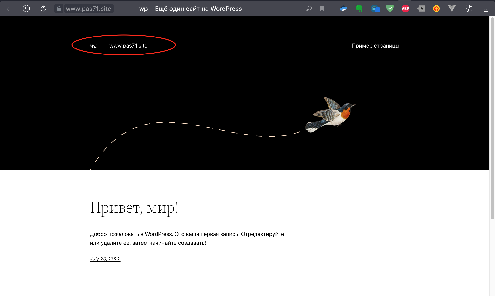
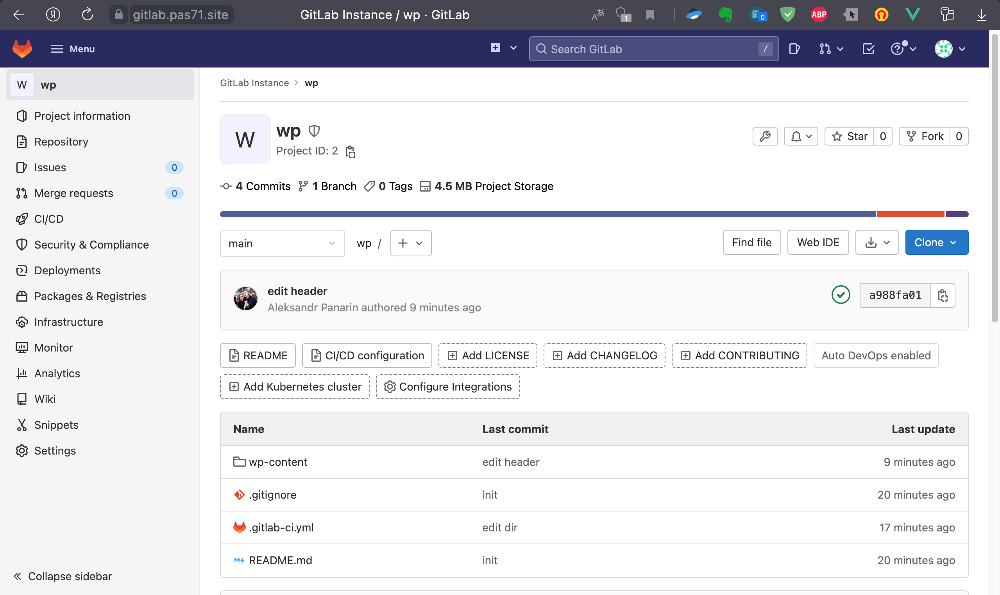

## Данный набор скриптов:

1. Готовит инфраструктуру с помощью Terraform на базе облачного провайдера YandexCloud.
1. Настраивает внешний Reverse Proxy на основе Nginx и LetsEncrypt.
1. Настраивает кластер MySQL.
1. Устанавливает WordPress.
1. Разворачивает Gitlab CE.
1. Настраивает мониторинг инфраструктуры с помощью стека: Prometheus, Alert Manager и Grafana.  

Что **необходимо** для запуска:  
1. Учетная запись в Yandex.Cloud
2. Домен, делегированный на `ns1.yandexcloud.net` и `ns2.yandexcloud.net` . Имя домена - в переменную `TF_VAR_fqdn` в файле `var.sh`
3. YC - Создать облако. ID облака - в переменную `TF_VAR_cloud_id` в файле `var.sh` 
4. YC - Создать каталог. ID каталога - в переменную `TF_VAR_folder_id` в файле `var.sh`
5. YC - Создать Object Storage (bucket). Добавить имя бакета в файл `var.sh` `bucket     = <your-bucket-name>`
6. YC - Создать сервисный аккаунт с ролью `editor`. Сгенерировать статический ключ доступа для этого аккаунта. ID и секрет ключа записать в соответствующие параметры в файл `var.sh`: `access_key = <your-access-key>` `secret_key = <your-secret-key>`
7. YC - Получить OAuth токен по инструкции [здесь](https://cloud.yandex.ru/docs/iam/concepts/authorization/oauth-token). OAuth токен - в переменную `TF_VAR_token` в файле `var.sh`
8. Запуск происходит в workspace `stage`.
  
Запуск bash:
```
$ ./run.sh
```

Примечание:
1. Для изменения типа выдаваемого сертификата, в `ansible/roles/nginx/defaults/main.yml`, поставить `letsencrypt_staging: true` - для отладки.
2. Время ожидания поднятия ВМ задается в файле `ansible.tf` `command = "sleep <time>"`. При необходимости, можно запускать Ansible в ручную `ansible-playbook -i ../ansible/inventory.yml ../ansible/play.yml`
3. Параметры создаваемых ВМ описаны в переменной `hosts` в файле `variables.tf`
4. Если нужно чтобы ВМ не отключались через 24 часа необходимо выставить `preemptible = false` в файле `compute.tf`. Сейчас стоит true для экономии.   

#### CI/CD  

1. Заходим в локальный gitlab.  
2. Создаем новый публичный репозиторий.  
3. Правим `WORDPRESS_SITE_DIR` в `./cicd/.gitlab-ci.yml` - указываем свой домен
4. Копируем любым доступным способом в этот репозиторий файлы из каталога `cicd`  
5. В настройках CI/CD, в разделе Runners, находим и копируем токен доступа, вписываем его для переменно `runner_token` в файле `vars_cicd.sh` 
6. Заходим на сайт `www.здесь_наш_домен`, делаем первоначальную настройку

Для запуска пайплайнов необходимо подготовить сервер, развернув на нем gitlab-runner и wp-cli
```bash
./run_cicd.sh
```
Для демонстрации работы CI/CD на Wordpress изменим чего-либо в заголовке. 

До изменения:


Изменим файл `wp-content/themes/mytheme/parts/header.html`. Добавим свой текст - `www.здесь_наш_домен`

После коммита ждем отработки задачи.

Обновляем страницу и видим, что текст добавился:



Описание действий, которые делает раннер, в комментариях в файле `.gitlab-ci.yml`


### Скриншоты веб-интерфейсов всех сервисов работающих по HTTPS на вашем доменном имени.
https://www.pas71.site (WordPress):

https://gitlab.pas71.site (Gitlab):

https://grafana.pas71.site (Grafana):

https://prometheus.pas71.site (Prometheus):

https://alertmanager.pas71.site(Alert Manager):
