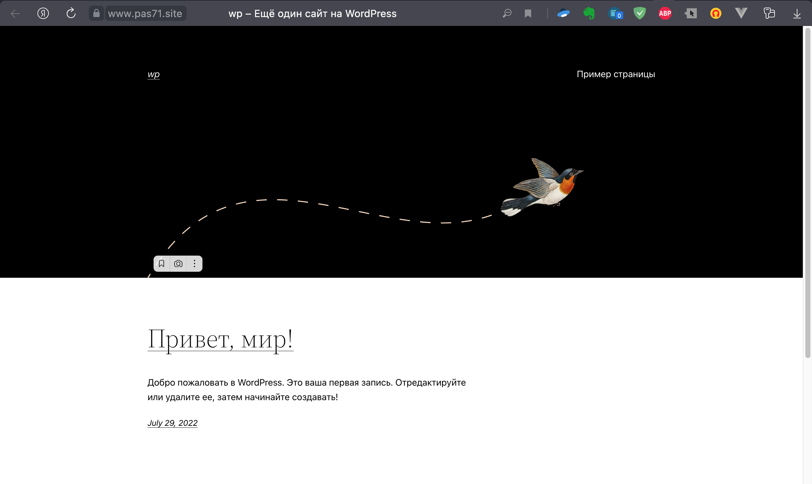
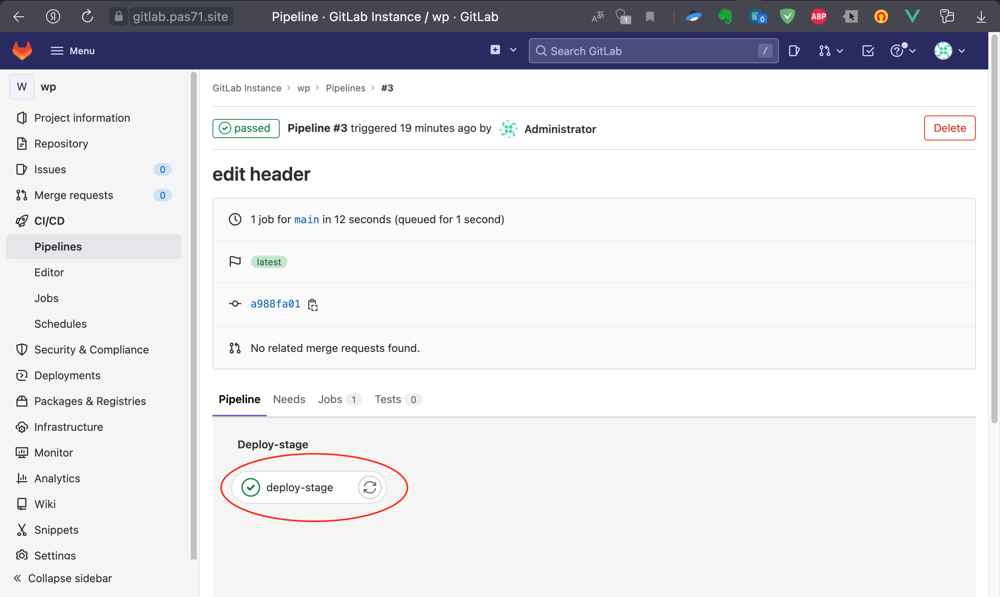
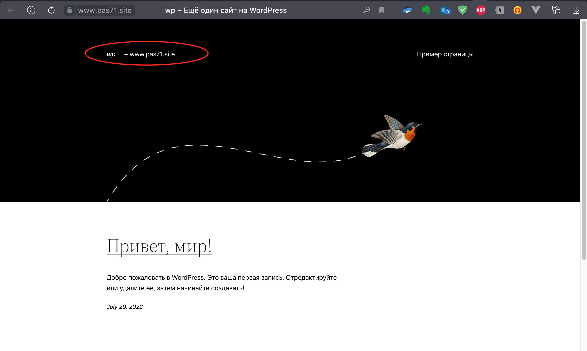

# CI/CD

#### CI/CD  

1. Заходим в локальный gitlab.  
2. Создаем новый публичный репозиторий.  
3. Правим `WORDPRESS_SITE_DIR` в `./cicd/.gitlab-ci.yml` - указываем свой домен
4. Копируем любым доступным способом в этот репозиторий файлы из каталога `cicd`  
5. В настройках CI/CD, в разделе Runners, находим и копируем токен доступа, вписываем его для переменно `runner_token` в файле `vars_cicd.sh` 
6. Заходим на сайт `www.здесь_наш_домен`, делаем первоначальную настройку

Для запуска пайплайнов необходимо подготовить сервер, развернув на нем gitlab-runner и wp-cli
```bash
./run_cicd.sh
```
Для демонстрации работы CI/CD на Wordpress изменим чего-либо в заголовке. 

До изменения:


Изменим файл `wp-content/themes/mytheme/parts/header.html`. Добавим свой текст - `www.здесь_наш_домен`

После коммита ждем отработки задачи.

Обновляем страницу и видим, что текст добавился:



Описание действий, которые делает раннер, в комментариях в файле `.gitlab-ci.yml`